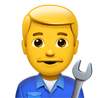

<h1 align="center"><br> Driver.js</h1>

<p align="center">
  <a href="https://github.com/kamranahmedse/driver.js/blob/master/license">
    
  </a>
  <a href="https://npmjs.org/package/driver.js">
    
  </a>
</p>

<p align="center">
  <b>Powerful yet light-weight, vanilla JavaScript engine to drive the user's focus across the page</b></br>
  <sub>Only ~4kb, no external dependency, supports all major browsers and highly customizable <sub>
</p>

<br />

* **Simple**: is simple to use and has no external dependency at all
* **Light-weight**: ~4kb in size, vanilla JavaScript and no external dependency
* **Highly customizable**: has a powerful API and can be used however you want
* **Highlight anything**: highlight any (literally any) element on page
* **Feature introductions**: create powerful feature introductions for your web applications
* **Focus shifters**: add focus shifters for users
* **User friendly**: Everything is controllable by keyboard
* **Consistent behavior**: usable across all browsers (including in-famous IE)
* **MIT Licensed**: free for personal and commercial use


For Usage and Examples, [have a look at demo](http://kamranahmed.info/driver.js)

## So, yet another tour library?

**No**, it is not. **Tours are just one of the many use-cases**. Driver.js can be used wherever you need some sort of overlay for the page; some common usecases could be: e.g. dimming the background when user is interacting with some component i.e. [the way Facebook does](https://i.imgur.com/Q3PzaKkr.png) when you try to create a post, using it as a focus shifter to bring user's attention to some component on page, or using it to simulate those "Turn off the Lights" widgets that you might have seen on video players online, etc.

Driver.js is written in Vanilla JS, has zero dependencies and is highly customizable. It has several options allowing you to manipulate how it behaves and also **provides you the hooks** to manipulate the elements as they are highlighted, about to be highlighted, or deselected.

## Installation

You can install it using `yarn` or `npm`, whatever you prefer.

```bash
yarn add driver.js
npm install driver.js
```
Or include it using CDN. If you want a specific version, put it as `driver.js@0.5` in the name
```html
<script src="https://unpkg.com/driver.js/dist/driver.min.js"></script>
<link rel="stylesheet" href="https://unpkg.com/driver.js/dist/driver.min.css">
```

Or grab the code from `dist` directory and include it directly.

```html
<link rel="stylesheet" href="/dist/driver.min.css">
<script src="/dist/driver.min.js"></script>
```


## Usage and Demo

Demos and many more usage examples can be found [in the docs page](http://kamranahmed.info/driver.js).

### Highlighting Single Element – [Demo](http://kamranahmed.info/driver.js#single-element-no-popover)

You can highlight a single element by simply passing the selector.

```javascript
const driver = new Driver();
driver.highlight('#create-post');
```
A real world usage example for this is: using it to dim the background and highlight the required element e.g. the way Facebook does it when creating a post.

### Highlight and Popover – [Demo](http://kamranahmed.info/driver.js#single-element-with-popover)

You can show additional details beside the highlighted element using the popover.

```javascript
const driver = new Driver();
driver.highlight({
  element: '#some-element',
  popover: {
    title: 'Title for the Popover',
    description: 'Description for it',
  }
});
```

Also, `title` and `description` can have HTML as well.

### Positioning the Popover – [Demo](http://kamranahmed.info/driver.js#single-element-with-popover-position)

By default, driver automatically finds the suitable position for the popover and displays it. You can override it using `position` property.

```javascript
const driver = new Driver();
driver.highlight({
  element: '#some-element',
  popover: {
    title: 'Title for the Popover',
    description: 'Description for it',
    // position can be left, left-center, left-bottom, top,
    // top-center, top-right, right, right-center, right-bottom,
    // bottom, bottom-center, bottom-right
    position: 'left',
  }
});
```

You can also add offset to the popover position by using the `offset` property

```javascript
const driver = new Driver();
driver.highlight({
  element: '#some-element',
  popover: {
    title: 'Title for the Popover',
    description: 'Description for it',
    position: 'bottom',
    // Will show it 20 pixels away from the actual position of popover
    // You may also provide the negative values
    offset: 20,
  }
});
```

### Creating Feature Introductions – [Demo](http://kamranahmed.info/driver.js)

Feature introductions are helpful when onboarding new users and giving them an idea about different parts of the application; you can create them seemlessly with Driver. Define the steps and call the `start` when you want to start presenting. User will be able to control the steps using the keyboard or using the buttons on popovers.

```javascript
const driver = new Driver();

// Define the steps for introduction
driver.defineSteps([
  {
    element: '#first-element-introduction',
    popover: {
      title: 'Title on Popover',
      description: 'Body of the popover',
      position: 'left'
    }
  },
  {
    element: '#second-element-introduction',
    popover: {
      title: 'Title on Popover',
      description: 'Body of the popover',
      position: 'top'
    }
  },
  {
    element: '#third-element-introduction',
    popover: {
      title: 'Title on Popover',
      description: 'Body of the popover',
      position: 'right'
    }
  },
]);

// Start the introduction
driver.start();
```
You can also hide the buttons and control the introductions programmatically by using the API methods listed below.


### Asynchronous Actions – [Demo](http://kamranahmed.info/driver.js)

For any asynchronous actions between the transition steps, you may delay the execution till the action completes. All you have to do is stop the transition using `driver.preventMove()` in your `onNext` or `onPrevious` callbacks and initiate it manually using `driver.moveNext()`. Here is a sample implementation where it will stop at the second step for four seconds and then move on to the next step.

```javascript
const driver = new Driver();

// Define the steps for introduction
driver.defineSteps([
  {
    element: '#first-element-introduction',
    popover: {
      title: 'Title on Popover',
      description: 'Body of the popover',
      position: 'left'
    }
  },
  {
    element: '#second-element-introduction',
    popover: {
      title: 'Title on Popover',
      description: 'Body of the popover',
      position: 'top'
    },
    onNext: () => {
      // Prevent moving to the next step
      driver.preventMove();
      
      // Perform some action or create the element to move to
      // And then move to that element
      setTimeout(() => {
        driver.moveNext();
      }, 4000);
    }
  },
  {
    element: '#third-element-introduction',
    popover: {
      title: 'Title on Popover',
      description: 'Body of the popover',
      position: 'right'
    }
  },
]);

// Start the introduction
driver.start();
```
You can also hide the buttons and control the introductions programmatically by using the API methods listed below.


## API

Driver comes with several options that you can manipulate to make Driver behave as you like

### Driver Definition

Here are the options that Driver understands:

```javascript
const driver = new Driver({
  animate: true,                    // Whether to animate or not
  opacity: 0.75,                    // Background opacity (0 means only popovers and without overlay)
  padding: 10,                      // Distance of element from around the edges
  allowClose: true,                 // Whether the click on overlay should close or not
  overlayClickNext: false,          // Whether the click on overlay should move next
  doneBtnText: 'Done',              // Text on the final button
  closeBtnText: 'Close',            // Text on the close button for this step
  stageBackground: '#ffffff',       // Background color for the staged behind highlighted element
  nextBtnText: 'Next',              // Next button text for this step
  prevBtnText: 'Previous',          // Previous button text for this step
  showButtons: false,               // Do not show control buttons in footer
  keyboardControl: true,            // Allow controlling through keyboard (escape to close, arrow keys to move)
  scrollIntoViewOptions: {},        // We use `scrollIntoView()` when possible, pass here the options for it if you want any
  onHighlightStarted: (Element) => {}, // Called when element is about to be highlighted
  onHighlighted: (Element) => {},      // Called when element is fully highlighted
  onDeselected: (Element) => {},       // Called when element has been deselected
  onReset: (Element) => {},            // Called when overlay is about to be cleared
  onNext: (Element) => {},                    // Called when moving to next step on any step
  onPrevious: (Element) => {},                // Called when moving to next step on any step
});
```
Note that all the button options that you provide in the driver definition can be overridden for a specific step by giving them in the step definition

### Step Definition

Here are the set of options that you can pass while defining steps `defineSteps` or the object that you pass to `highlight` method:

```javascript
const stepDefinition = {
  element: '#some-item',        // Query selector string or Node to be highlighted
  stageBackground: '#ffffff',   // This will override the one set in driver
  popover: {                    // There will be no popover if empty or not given
    title: 'Title',             // Title on the popover
    description: 'Description', // Body of the popover
    showButtons: false,         // Do not show control buttons in footer
    doneBtnText: 'Done',        // Text on the last button
    closeBtnText: 'Close',      // Text on the close button
    nextBtnText: 'Next',        // Next button text
    prevBtnText: 'Previous',    // Previous button text
  },
  onNext: () => {},             // Called when moving to next step from current step
  onPrevious: () => {},         // Called when moving to next step from current step
};
```

For example, here is how it would look when highlighting a single element:

```javascript
const driver = new Driver(driverOptions);
driver.highlight(stepDefinition);
```

And this is how it would look when creating a step by step guide:

```javascript
const driver = new Driver(driverOptions);
driver.defineSteps([
    stepDefinition1,
    stepDefinition2,
    stepDefinition3,
    stepDefinition4,
]);
```

### API Methods

Below are the set of methods that are available:

```javascript
const driver = new Driver(driverOptions);

// Checks if the driver is active or not
if (driver.isActivated) {
    console.log('Driver is active');
}

// In case of the steps guide, you can call below methods
driver.defineSteps([ stepDefinition1, stepDefinition2, stepDefinition3 ]);
driver.start(stepNumber = 0);  // Starts driving through the defined steps
driver.moveNext();             // Moves to next step in the steps list
driver.movePrevious();         // Moves to previous step in the steps list
driver.hasNextStep();          // Checks if there is next step to move to
driver.hasPreviousStep();      // Checks if there is previous step to move to

// Prevents the current move. Useful in `onNext` or `onPrevious` if you want to
// perform some asynchronous task and manually move to next step
driver.preventMove();

// Highlights the element using query selector or the step definition
driver.highlight(string|stepDefinition);

// Resets the overlay and clears the screen
driver.reset();
// Additionally you can pass a boolean parameter
// to clear immediately and not do the animations etc
// Could be useful when you, let's say, want to run
// a different instance of driver while one was running
driver.reset(clearImmediately = false);

// Checks if there is any highlighted element
if(driver.hasHighlightedElement()) {
    console.log('There is an element highlighted');
}

// Gets the currently highlighted element on screen
// It would be an instance of `/src/core/element.js`
const activeElement = driver.getHighlightedElement();

// Gets the last highlighted element, would be an instance of `/src/core/element.js`
const lastActiveElement = driver.getLastHighlightedElement();

activeElement.getCalculatedPosition(); // Gets screen co-ordinates of the active element
activeElement.hidePopover();           // Hide the popover
activeElement.showPopover();           // Show the popover

activeElement.getNode();  // Gets the DOM Element behind this element
```

**Note –** Do not forget to add `e.stopPropagation()` to the `click` binding that triggers driver.


## Contributions

Feel free to submit pull requests, create issues or spread the word.

## Sponsored By

Thanks to [BrowserStack](https://browserstack.com) for sponsoring the compatibility testing needs.

[](https://www.browserstack.com)

## License

MIT &copy; [Kamran Ahmed](https://twitter.com/kamranahmedse)


